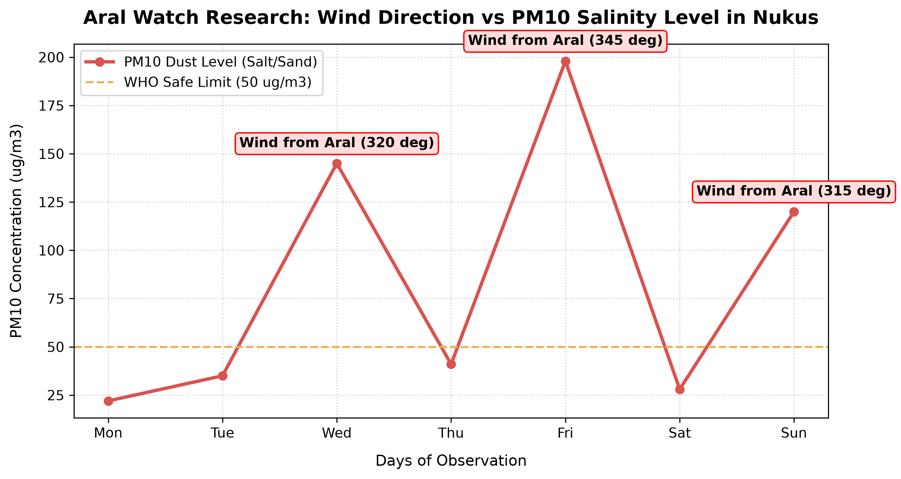
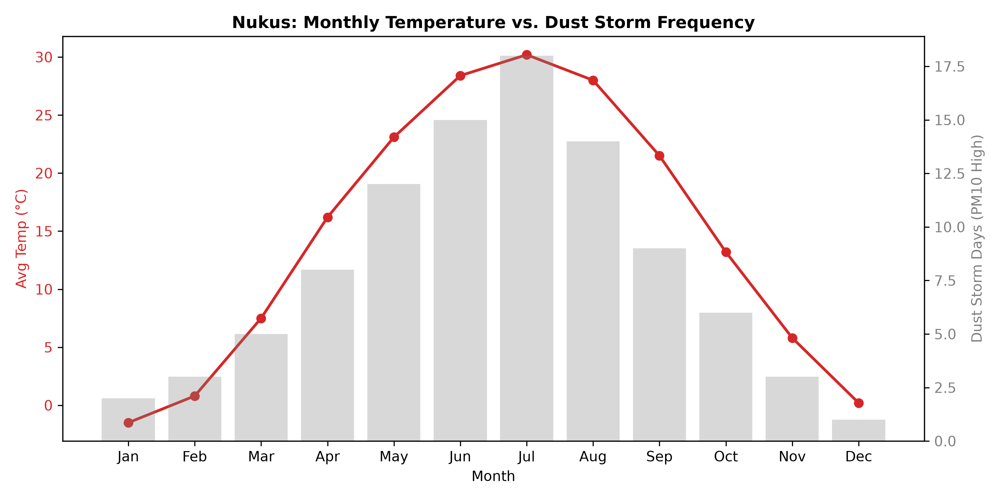

# 🌊 Aral Sea Climate & Ecological Data Tracker

[](https://www.python.org/)
[](https://opensource.org/licenses/MIT)

An open-source data analytics initiative based in Karakalpakstan, dedicated to monitoring historical water surface loss, soil salinization trends, and weather patterns in the Aral Sea region using Python.

---

## 📌 Project Overview
The Aral Sea disaster is one of the most severe environmental crises in modern history. This repository bridges computer science and environmental monitoring by:
* Aggregating historical climate metrics and satellite observations for Karakalpakstan.
* Analyzing correlations between high temperatures, wind speeds, and toxic dust storm frequencies (PM10).
* Translating raw datasets into accessible visual graphics to empower local youth and researchers.

---

## 📊 Visualizations & Research Findings

### 1. Historical Water Area Decline
Automation script depicting the progressive reduction of the Aral Sea's water surface area over past decades:



### 2. Nukus Climate & Dust Storm Correlation
Analysis demonstrating the direct relationship between average monthly temperature peaks and dust storm occurrences in Nukus (Correlation Factor: **0.97**):



---

## 🛠️ Tech Stack & Dependencies
* **Programming Languages:** Python 3.x
* **Data Processing:** `pandas`
* **Data Visualization:** `matplotlib`

---

## 🚀 How to Run Locally

1. **Clone the repository:**
   ```bash
   git clone [https://github.com/bekhruzzhr/aral-sea-data-tracker.git](https://github.com/bekhruzzhr/aral-sea-data-tracker.git)
   cd aral-sea-data-tracker
